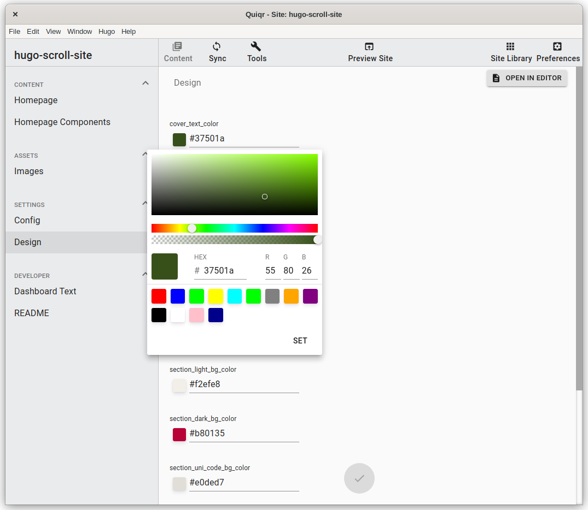

# quiqr-scroll-template

Quiqr template based on the [Hugo Scroll theme](https://github.com/zjedi/hugo-scroll) for pretty, quick and simple single-page websites.

The CMS in Quiqr features editing all menu items, text and images and easily lets you change the design.

## Showcase

- [Studio for rent in the Provence](https://lincel.com)

## 👏 Special Thanks 
- [zjedi](https://github.com/zjedi/) - latest author of the theme 
- [Jan Raasch](https://www.janraasch.com), original author of theme
- [Yonatan Wolowelsky](https://github.com/grmmph), author of [GhostScroll](https://github.com/grmmph/GhostScroll) theme, which formed the basis of this [Hugo](https://gohugo.io/) theme.
- [Pexels](https://www.pexels.com), for supplying _free_ stock photos.

